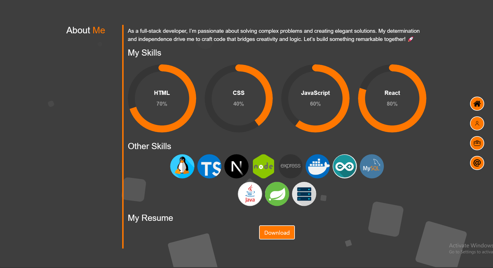

# React-Showcase
## Ross Charlton - React - Web development portfolio 🚀

## Description

This repository showcases my web development portfolio using React & Bootstrap, as a testament to my skills in the dynamic field of web development. Crafted with a mission to highlight my expertise, it serves as a vital asset in today's competitive market.

The main aim of this GitHub project is to use React to improve on [previous portfolio](https://rossne99.github.io/Bootstrap-portfolio/). The motivation behind this project was to recreate my portfolio and retain the functionality and with thanks to the use of React the code in this project is a lot diffrent to the previous portfolio as here i have used NodeJS and react. React uses the JSX syntax whitch is alot diffrent from normal html. 

The problem with Traditional HTML and CSS, while foundational for web development, often lead to repetitive and verbose code. Developers must manually handle browser compatibility and responsiveness, which can result in a cluttered codebase. This approach lacks modularity, making maintenance and scaling difficult. By integrating Node.js and React, developers can streamline their workflow. Node.js offers a vast ecosystem of packages, allowing for reusable components and efficient build processes. React’s component-based architecture enables a more organized and maintainable code structure. Together, they facilitate faster development, better performance, and a more dynamic user experience. React’s virtual DOM and Node.js’s non-blocking I/O model further optimize rendering and server communication, respectively. This modern stack transforms the development process, making it more agile and robust.

Please see a full list of features [here](#features)

## Table of Contents

- [Dev Requirements](#dev-requirements)
- [Dev Environment Setup](#dev-environment-setup)
- [Enduser usage instructions](#end-user-usage-instructions)
- [Features](#features)
- [How to contribute](#how-to-contribute)
- [technologies ](#technologies)
- [Screenshot](#screenshot)
- [Tests](#tests)
- [Credits](#credits)
- [License](#license)

## Dev Requirements
Git/GitBash, VS Code, NodeJS, and the source code, of course! 🛠️

## Dev Environment Setup
Please make sure you have NodeJS downloaded
To get the development environment running:
1. Clone this repo
2. Navagate to the repo on your local machine
3. run `npm i` and this will install all the depencencys needed
4. run `npm run dev` to run!

- `index.js`: Contains the js code to initialize and run the app
- `src/`: Contains all javaScript code to allow this app to function

## Enduser usage instructions
There is no special requirements for end users. Simply visit [here](https://ross-portfolio.netlify.app/) to view the webpage.

## Features
- **Fully Responsive:** This webpage uses bootstrap brakepoints to ensure that the content fits on any screen size.
- **Robust Layout:** Grid and flexbox has been used inorder to make sure all elements stay formatted correctly.
- **Fixed Navber:** The navbar is now fixed to the top of the page this is useful for accessibility additionally all the links in the nav bar now work.
- **Links to Previous Projets:** All featured applcations link to the deployed page.
- **Bootstrap:** Bootstrap has been used to reduce boilerplate code, and to make the webpage look more profesional

## How to contribute
1. Fork this repository
2. Clone the repository
3. Create a branch for your bug fix or feature
4. Make necessary changes and commit those changes
5. Push changes to GitHub
6. Create a pull request to this repo to submit your changes for review

## Technologies
- **JavaScript**
- **NodeJS**
- **Bootstrap**

## Screenshot

The following image shows the application's functionality:

> **Note**: This is a screenshot of the about me section, all of the layouts is designed to be fully responive.

## Tests
- There are no tests added yet

## Credits 
- **Ross** - Source Code

---

## Licence

MIT License

Copyright (c) 2024 RossNE99

Permission is hereby granted, free of charge, to any person obtaining a copy
of this software and associated documentation files (the "Software"), to deal
in the Software without restriction, including without limitation the rights
to use, copy, modify, merge, publish, distribute, sublicense, and/or sell
copies of the Software, and to permit persons to whom the Software is
furnished to do so, subject to the following conditions:

The above copyright notice and this permission notice shall be included in all
copies or substantial portions of the Software.

THE SOFTWARE IS PROVIDED "AS IS", WITHOUT WARRANTY OF ANY KIND, EXPRESS OR
IMPLIED, INCLUDING BUT NOT LIMITED TO THE WARRANTIES OF MERCHANTABILITY,
FITNESS FOR A PARTICULAR PURPOSE AND NONINFRINGEMENT. IN NO EVENT SHALL THE
AUTHORS OR COPYRIGHT HOLDERS BE LIABLE FOR ANY CLAIM, DAMAGES OR OTHER
LIABILITY, WHETHER IN AN ACTION OF CONTRACT, TORT OR OTHERWISE, ARISING FROM,
OUT OF OR IN CONNECTION WITH THE SOFTWARE OR THE USE OR OTHER DEALINGS IN THE
SOFTWARE.